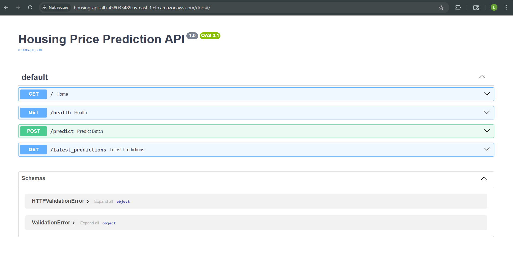
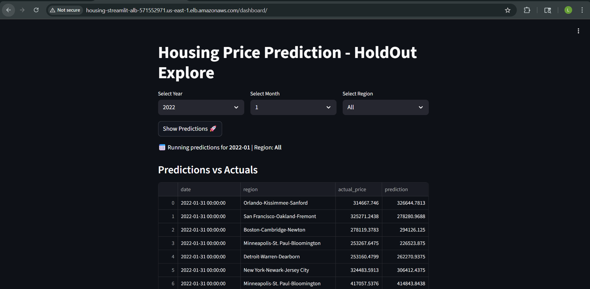
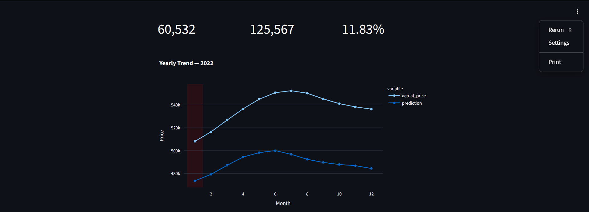
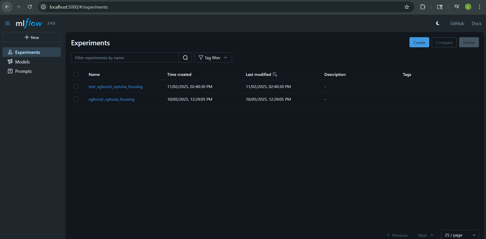
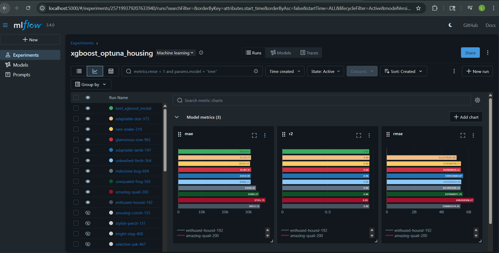
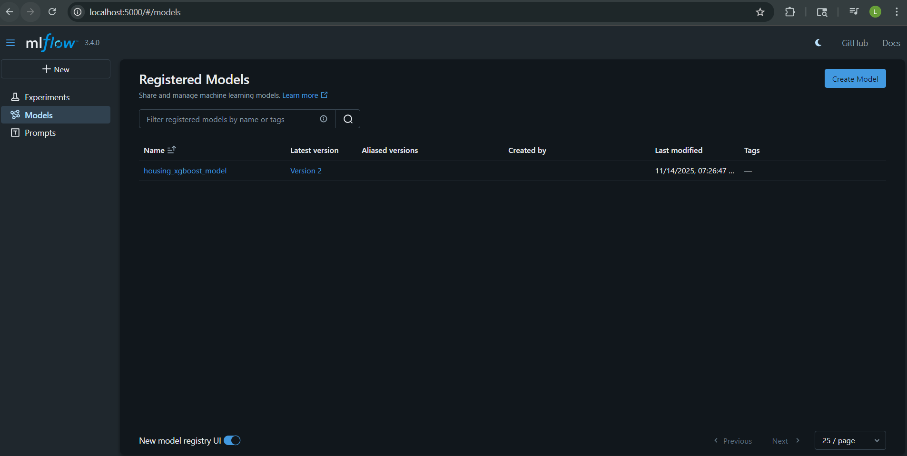
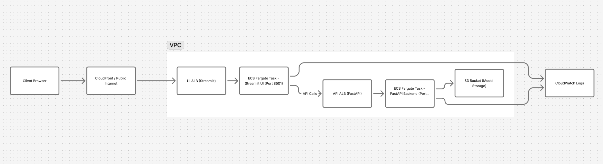

# End-to-End Mlops Production ready: Housing Price Prediction Pipeline 🏠

## 📋 Project Overview

This project implements a complete, production-ready Machine Learning pipeline for predicting housing prices. It goes beyond simple model training by implementing MLOps best practices, ensuring the model is reproducible, trackable, and deployable.

The system is built using a modular architecture, containerized with Docker, and deployed to AWS ECS (Elastic Container Service) using Fargate.

Key Features

* Modular Pipeline: Separation of concerns with dedicated pipelines for feature_engineering, training, and inference.

* Experiment Tracking: Full integration with MLflow for tracking hyperparameters, metrics, and model versioning.

* Advanced Data Processing: Includes dedicated notebooks for data cleaning, frequency encoding, and target encoding.

* Microservices Architecture:

  - API Service: A FastAPI backend serving predictions.

  - UI Service: A Streamlit frontend for user interaction.

* Infrastructure as Code: Includes AWS Task Definitions (housing-api-task-def.json) for ECS deployment.

* CI/CD: Automated testing (pytest) and deployment workflows via GitHub Actions.

## 📸 Project Screenshots
Fast API :

.

Streamlit UI

The user interface for making predictions.
.
.

MLflow Tracking

Experiment tracking and model registry dashboard.

.
.
.

## 🛠️ Tech Stack & Tools

| Category | Technologies |
| :--- | :---: |
| Language & Env | Python 3.11, uv (Astral) |
| ML Libraries | XGBoost, Scikit-Learn, Pandas, Numpy |
| Tracking | MLflow |
| Web Frameworks | FastAPI (Backend), Streamlit (Frontend)|
| Containerization | Docker, Docker Compose |
| Cloud (AWS) | ECR (Registry), ECS (Orchestration), S3 (Storage), EC2 |
| Testing | Pytest, Smoke Tests (Jupyter) |

## ☁️ Cloud Architecture

The application is deployed on AWS using a serverless container architecture. The diagram below illustrates the flow from code commit to production deployment.

.

## 🔄 Deployment Workflow

* Push to GitHub: Code is pushed to the repository, triggering the ci.yaml workflow.

* Continuous Integration: GitHub Actions runs the unit tests (pytest).

* Continuous Delivery:

    If tests pass, the Docker images are built.

    Images are tagged and pushed to Amazon Elastic Container Registry (ECR).

* Deployment: Amazon ECS pulls the new images and updates the running Fargate tasks with zero downtime.

## 🏗️ Design Decisions

Why AWS Fargate? We chose Fargate (Serverless ECS) to avoid managing EC2 instances. It scales automatically and reduces operational overhead.

Why Docker? Ensures the model runs exactly the same in the cloud as it does on the local machine.

Why Separation of Concerns? The UI (Streamlit) interacts with the Model only via the API (FastAPI), decoupling the frontend from the ML logic.

## 📂 Project Structure

```text
REGRESSION_ML_END_TO_END/
│
├── .github/
│   └── workflows/                 # CI/CD pipelines (ci.yml)
├── data/                          # Raw and processed datasets
├── models/                        # Serialized models (xgb_model.pkl, encoders)
│
├── notebooks/                     # Experimentation & EDA
│   ├── 00_data_processing.ipynb
│   ├── 01_data_cleaning.ipynb
│   ├── 02_feature_eng_and_encoding.ipynb
│   ├── 03_basline_model.ipynb
│   ├── 05_xgboost.ipynb
│   ├── 06_Hyperparameter_tuning_mlflow.ipynb
│   └── 07_Push_dataset_aws.ipynb
│
├── src/                           # Production Source Code
│   ├── api/                       # FastAPI application (main.py)
│   ├── feature_pipeline/          # Data transformation logic
│   ├── inference_pipeline/        # Prediction logic
│   └── training_pipeline/         # Model training logic
│
├── tests/                         # Unit & Integration tests
│
├── housing-api-task-def.json      # AWS ECS Task Definition (API)
├── streamlit-task-def.json        # AWS ECS Task Definition (UI)
├── Dockerfile                     # API Docker Image
├── Dockerfile.streamlit           # UI Docker Image
├── docker-compose.yml             # Local orchestration
└── pyproject.toml                 # Dependencies
```

## 🚀 Local Installation & Setup

This project uses uv for high-performance dependency management.

### 1. Initialize Environment
``` bash
# 1. Initialize uv and python version
uv init
uv python install 3.11
uv python pin 3.11

# 2. Install Dependencies
uv sync

#3. Activate the virtual environment (Powershell)
.\.venv\Scripts\Activate
```

### 2. VS Code Configuration (Manual Step)

To ensure VS Code uses the correct environment:

Open the Command Palette (Ctrl+Shift+P).

Search for Python: Select Interpreter.

Select the path manually:

``` bash
.\.venv\Scripts\python.exe
```
### 3. Setup Jupyter Kernel

Required for running the notebooks locally:
``` bash
# Install kernel support
uv add ipykernel

# Register the kernel
python -m ipykernel install --user --name=regression-ml-end-to-end --display-name "regression-ml-end-to-end"
``` 

## 🏃 Running the Application

## Option A: Docker Compose (Recommended)

Build and run both the API and the UI simultaneously.
``` bash
# 1. Start application
docker compose up -d

# 2. Rebuild and start (use this if you modify code or Dockerfiles)
docker compose up -d --build

# 3. Stop application
docker compose down
``` 

API Docs: http://localhost:8000/docs

Streamlit UI: http://localhost:8501

MLflow UI: http://localhost:5000

## Option B: Running Services Manually

### 1. Start MLflow UI
View experiment logs and model registry.
``` bash
mlflow ui
Accessible at [http://127.0.0.1:5000](http://127.0.0.1:5000)
Press CTRL + C to Quit
``` 

### 2. Run FastAPI Backend
``` bash
uvicorn src.api.main:app --reload
``` 

### 3. Run Streamlit Frontend
(If running outside Docker)
``` bash
streamlit run src/ui/app.py 
### (Adjust path based on your specific UI file location)
``` 

## 🐳 Docker Commands (Manual)

If you need to build specific images individually using docker run with environment variables:

### 1. Build & Run API

``` bash
docker build -t regression-ml-api . 

# Run container with AWS Credentials (replace values as needed)
docker run -d -p 8000:8000 --name regression_api \
    -e AWS_ACCESS_KEY_ID="" \
    -e AWS_SECRET_ACCESS_KEY="" \
    -e AWS_DEFAULT_REGION="us-east-1" \
    regression-ml-api 

```
### 2. Build & Run UI
``` bash
docker build -t regression-ml-ui . -f Dockerfile.streamlit

docker run -d -p 8501:8501 --name regression-ml-ui regression-ml-ui
```

🧪 Testing

The project includes a robust testing suite using pytest.
``` bash
# Run all tests
pytest tests/

# Run specific tests
pytest tests/test_train.py
pytest tests/test_inference.py

```
## 👥 Who Is This For?

> [!IMPORTANT]
> This collection is perfect for:
>
> - **DevOps & DevSecOps & MLOps Engineers**: Get quick access to the tools you use every day.
> - **Sysadmins**: Simplify operations with easy-to-follow guides.
> - **Developers**: Understand the infrastructure behind your applications.
> - **DevOps Newcomers**: Transform from beginner to expert with in-depth concepts and hands-on projects.

## 🛠️ How to Use This Repository

> [!NOTE]
> 1. **Explore the Categories**: Navigate through the folders to find the tool or technology you’re interested in.
> 2. **Use the Repositories**: Each repository is designed to provide quick access to the most important concepts and projects.

## 🤝 Contributions Welcome!

We believe in the power of community! If you have a tip, command, or configuration that you'd like to share, please contribute to this repository. Whether it’s a new tool or an addition to an existing content, your input is valuable.

## 📢 Stay Updated

This repository is constantly evolving with new tools and updates. Make sure to ⭐ star this repo to keep it on your radar!

## Liking the Project?

# ⭐❤️

If you find this project helpful, please consider giving it a ⭐! It helps others discover the project and keeps me motivated to improve it.

Thank you for your support!
---
## ✍🏼 Author

### Bala Senapathi
DevSecOps Engineer | Cloud & Automation | MLOps | AIOps | GitOps Specialist


---
Made with ❤️ and passion to contribute to the DevOps community by [Bala Senapathi](https://github.com/balusena)